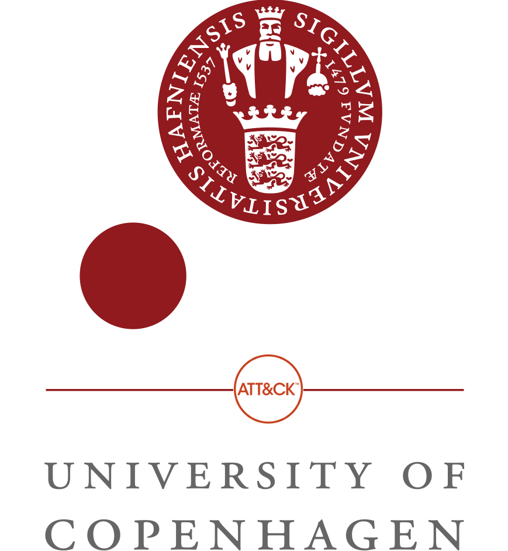

---

## Kort intro til ATT&CK

[Mitre](https://mitre.org/) er en ikke-for-profit organisation, der ”løser problemer for at sikre verdenen”[^1], som har lavet og vedligeholder ATT&CK frameworket, som systematisk sætter avancerede hackergrupperingers taktikker og teknikker ind i en ramme, så it-sikkerhedsfolk kan se hvad man bør holde styr på i et it-miljø.

*ATT&CK* er et akronym for *Advanced Tactics, Techniques & Common Knowledge*.

*Tactics* er målet for en given handling.

*Techniques* er metoden til at opnå målet.

## Kom i gang med Mitres ATT&CK framework

Bedste sted at få en masse info om ATT&CK er via Mitres forskellige sider online. Her kan man finde bl.a. [papers](https://www.mitre.org/publication-keywords/computer-security) samt [blog posts](https://medium.com/mitre-attack) og [videoer](https://www.youtube.com/watch?v=yslLIqfOKCU&list=PLkTApXQou_8JrhtrFDfAskvMqk97Yu2S2).

### Læsning

Hurtigt overblik over hovedpointer om ATT&CK:   
- [ATT&CK 101 Blog Post](https://medium.com/mitre-attack/att-ck-101-17074d3bc62)

#### Kom i gang blogposts fra Mitre:
Kan med fordel læses i denne rækkefølge.

1.	[Getting Started with ATT&CK: Threat Intelligence](https://medium.com/mitre-attack/getting-started-with-attack-cti-4eb205be4b2f)
2.	[Getting Started with ATT&CK: Detection and Analytics](https://medium.com/mitre-attack/getting-started-with-attack-detection-a8e49e4960d0)
3.	[Getting Started with ATT&CK: Adversary Emulation and Red Teaming](https://medium.com/mitre-attack/getting-started-with-attack-red-29f074ccf7e3)
4.	[Getting Started with ATT&CK: Assessments and Engineering](https://medium.com/mitre-attack/getting-started-with-attack-assessment-cc0b01769cb4)

Se også ATT&CK-hjemmesidens [Getting Started](https://attack.mitre.org/resources/getting-started/) afsnit for yderligere ressourcer.

### Videoer

<iframe width="560" height="315" src="https://www.youtube-nocookie.com/embed/0BEf6s1iu5g" frameborder="0" allow="accelerometer; autoplay; encrypted-media; gyroscope; picture-in-picture" allowfullscreen></iframe>

<iframe width="560" height="315" src="https://www.youtube-nocookie.com/embed/bkfwMADar0M" frameborder="0" allow="accelerometer; autoplay; encrypted-media; gyroscope; picture-in-picture" allowfullscreen></iframe>

Hvordan kan ATT&CK konkret anvendes i et SIEM?
- [MITRE ATT&CKcon 2018: Summiting the Pyramid of Pain: Operationalizing ATT&CK](https://www.youtube.com/watch?v=YhsN5pBDrGY)
- [MITRE ATT&CKcon 2018: From Technique to Detection](https://www.youtube.com/watch?v=a3hIIzJrH14) (~5:00)
- [Building The MITRE ATT&CK Technique Detection into Your Security Monitoring](https://www.brighttalk.com/webcast/14907/366642) (~1:00:00)

## Yderligere ressourcer
ATT&CK
- [Hjemmeside](https://attack.mitre.org/)
- [ATT&CK Navigator](https://mitre-attack.github.io/attack-navigator/enterprise/) ([om navigatoren](https://www.mitre.org/capabilities/cybersecurity/overview/cybersecurity-blog/the-attck%E2%84%A2-navigator-a-new-open-source))

Test af Detection Techniques:
-	Brug [Atomic Red Team](https://atomicredteam.io/testing) til automatisering af red team testing.

Andre relevante modeller:
- [Cyber Kill Chain](https://www.lockheedmartin.com/en-us/capabilities/cyber/cyber-kill-chain.html) fra Lockheed Martin
- [Pyramid of Pain](http://detect-respond.blogspot.com/2013/03/the-pyramid-of-pain.html)

## Nyttige forkortelser og Begreber

**APT** - Advanced Persistent Threat   
**ATT&CK** - Adversarial Tactics Techniques & Common Knowledge   
**CTI** - Cyber Threat Intelligence   
**CVE** - Common Vulnerabilities and Exposures   
**IOC** - Indicator of Compromise   
**SIEM** - Security Information and Event Management   
**SOC** - Security Operation Center   
**TTPs** - Tactics, Techniques, and Procedures   

Se flere på [Cybersecurity Dictionary](https://www.optiv.com/cybersecurity-dictionary).

[^1]: Ref.: [Corporate Overview](https://www.mitre.org/about/corporate-overview) (mitre.org)
